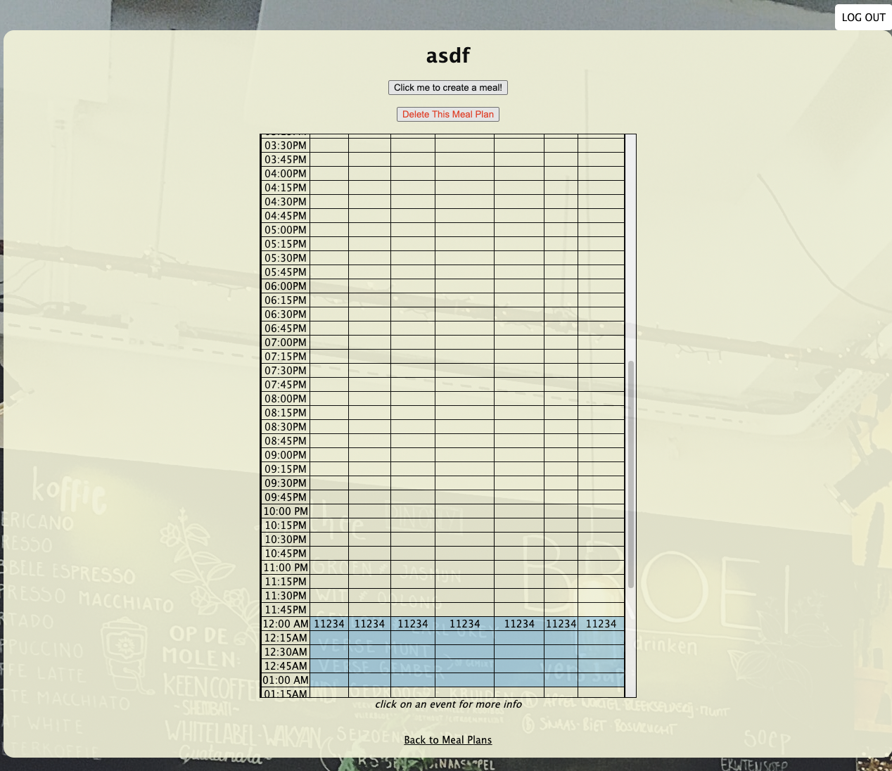
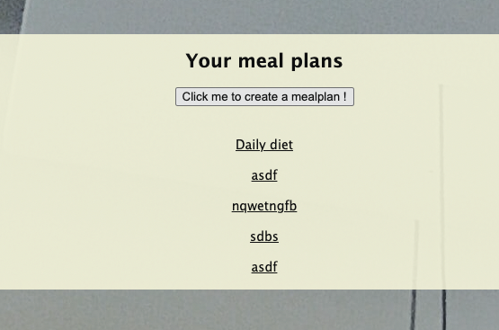
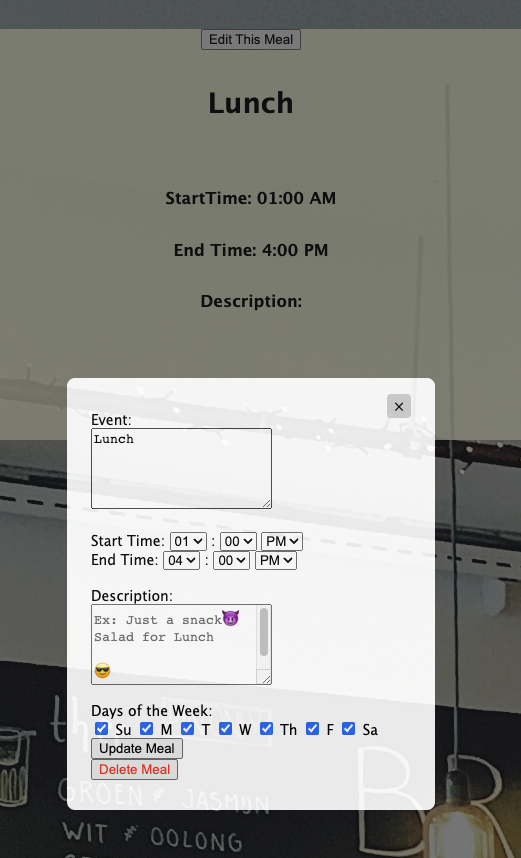

# get-in-my-mouth

## Get in my Mouth ##

## About
Get in my Mouth is a meal Planner that you can use for scheduling your weekly meals. 

The site can be found <a href="https://get-in-my-mouth.onrender.com">here</a>

## Screenshots:
<figure>
  <figcaption><strong>A Meal Plan</strong></figcaption>
  
</figure>

<figure>
  <figcaption><strong>Your Meal Plan Home Page</strong></figcaption>
  
</figure>

<figure>
  <figcaption><strong>Editing a Meal</strong></figcaption>
  
</figure>

## Technologies Used
- HTML
- CSS
- JavaScript
- EJS
- Express
- Node.js
- MongoDB + Mongoose
- npm packages

## Next Steps:
Implement a 3rd party API to allow a user to find a solution for a meal. For example, find the fastest restaurants or grocery stores near you. 